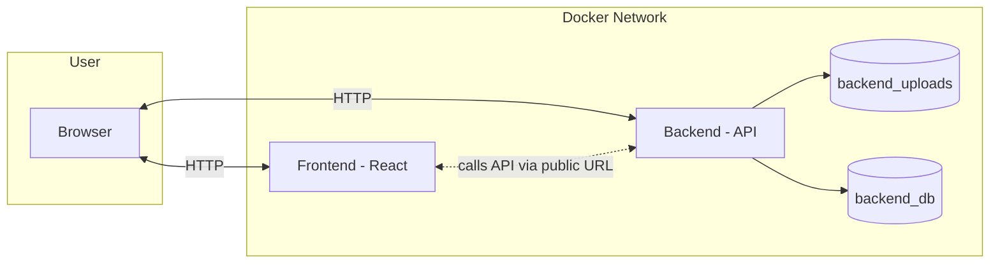

# Loyalty Wallet

A tidy, containerised loyalty card wallet that keeps your points and punch-cards in one place. Spin it up with Docker, open your browser, and stop rummaging for plastic. Simple, fast, and ready for real use.

> Built for developers who like clean repos and fewer fiddly steps.

---

## Highlights

- Two services, one command
- Frontend on port `3000`, API on port `8000`
- Persistent storage for uploads and the database
- Local-first setup that is easy to harden for production
- Works nicely behind a reverse proxy such as Caddy or Nginx

---

## Architecture at a glance



Notes
- The browser talks to the API via a public URL. For local development this is `http://localhost:8000`.
- In production, put both services behind a TLS-terminating reverse proxy, and set the frontend environment variable to your public API URL.

---

## Quick start

Prerequisites
- Docker and Docker Compose v2

Clone and run
```bash
git clone <your-repo-url>.git loyalty-wallet
cd loyalty-wallet
docker compose up -d --build
```

Open
- Frontend: http://localhost:3000
- API:      http://localhost:8000

Stop
```bash
docker compose down
```

Rebuild after code changes
```bash
docker compose build --no-cache
docker compose up -d
```

---

## Configuration

The compose file wires up two services and two named volumes.

```yaml
version: '3.8'

services:
  backend:
    build: ./backend
    container_name: loyalty-backend
    ports:
      - "8000:8000"
    volumes:
      - backend_uploads:/app/uploads
      - backend_db:/app/cards.db
    restart: unless-stopped

  frontend:
    build: ./frontend
    container_name: loyalty-frontend
    ports:
      - "3000:3000"
    environment:
      - REACT_APP_API_URL=http://localhost:8000
    restart: unless-stopped

volumes:
  backend_uploads:
  backend_db:
```

Important
- `REACT_APP_API_URL` is a browser-side variable. For local work `http://localhost:8000` is correct. In production, set it to your public API address, for example `https://api.yourdomain.tld`.
- The backend stores uploads in `/app/uploads` and the database at `/app/cards.db`.

### Recommended storage tweak

Mounting a **named volume** directly on a file path such as `/app/cards.db` is awkward, since Docker treats volumes as directories. A safer pattern is to keep the SQLite file inside a mounted directory, for example `/data/cards.db`.

If you can adjust the backend to read `DB_PATH=/data/cards.db`, here is a more robust compose snippet:

```yaml
services:
  backend:
    # ...
    environment:
      - DB_PATH=/data/cards.db
      - UPLOAD_DIR=/app/uploads
    volumes:
      - backend_uploads:/app/uploads
      - backend_db:/data
```

This lets you back up or inspect the whole database directory cleanly.

---

## Production checklist

- Put both services behind a reverse proxy with TLS
- Set `REACT_APP_API_URL` to the public API URL
- Restrict inbound ports to 80 and 443 at the edge, keep 3000 and 8000 private
- Enforce sensible upload limits and file type validation in the backend
- Set explicit CORS rules on the API
- Turn on structured logging and log rotation
- Add a health endpoint on the API, for example `/health` returning `{ status: "ok" }`

Example Caddyfile
```caddyfile
api.yourdomain.tld {
  reverse_proxy backend:8000
}

app.yourdomain.tld {
  reverse_proxy frontend:3000
}
```

> If the frontend is a single-page app, consider serving its static build from the proxy and keeping the API on a separate subdomain. Keeps things fast and tidy.

---

## Backups

Uploads
```bash
docker run --rm -v loyalty_wallet_backend_uploads:/data alpine \
  tar -czf - -C / data > uploads-backup.tgz
```

Database directory, using the recommended `/data` approach
```bash
docker run --rm -v loyalty_wallet_backend_db:/data alpine \
  tar -czf - -C / data > db-backup.tgz
```

Restore
```bash
docker run --rm -v loyalty_wallet_backend_db:/data -i alpine \
  tar -xzf - -C / < db-backup.tgz
```

Name prefixes
- Docker will prefix volumes with your project folder name. If your repo is named `loyalty-wallet`, Docker will create volumes like `loyalty-wallet_backend_db`. Adjust the commands accordingly.

---

## Development tips

- Frontend API URL for dev stays `http://localhost:8000` so the browser can reach it
- Use hot reload in both services for a quick feedback loop
- Add a `docker-compose.override.yml` for local-only options, for example bind mounts to your source folders

Example override
```yaml
services:
  backend:
    volumes:
      - ./backend:/app
      - backend_db:/data
  frontend:
    volumes:
      - ./frontend:/usr/src/app
```

---

## Roadmap ideas

- Barcode or QR rendering for card scan at tills
- Device camera support for scanning a card into the wallet
- Encrypted at-rest storage for sensitive fields
- Role-based access if you add multi-user support
- Job to prune orphaned uploads

If you would like these, open issues and keep the ideas coming.

---

## Contributing

Pull requests are welcome. Please keep your changes scoped and documented. If you are adding environment variables, document them in this README and include sensible defaults.

---

## Licence

MIT. If your organisation needs something different, open an issue.

---

## Troubleshooting

- Frontend cannot reach the API
  - For local use, keep `REACT_APP_API_URL=http://localhost:8000` so the browser calls your host. For production, set it to the public API URL.
- Database file missing
  - Use the recommended `/data/cards.db` pattern and ensure the directory exists or is created at startup.
- Permission issues on uploads
  - Ensure the backend initialises the uploads directory and has write permission. Consider setting an explicit UID and GID in the container if your host enforces stricter defaults.

---

## Why it exists

Loyalty points should be easy to keep and hard to lose. This wallet keeps everything in one neat place, saves time at the till, and helps you avoid the drawer full of plastic. Build it once, keep it running, and get on with your day.
